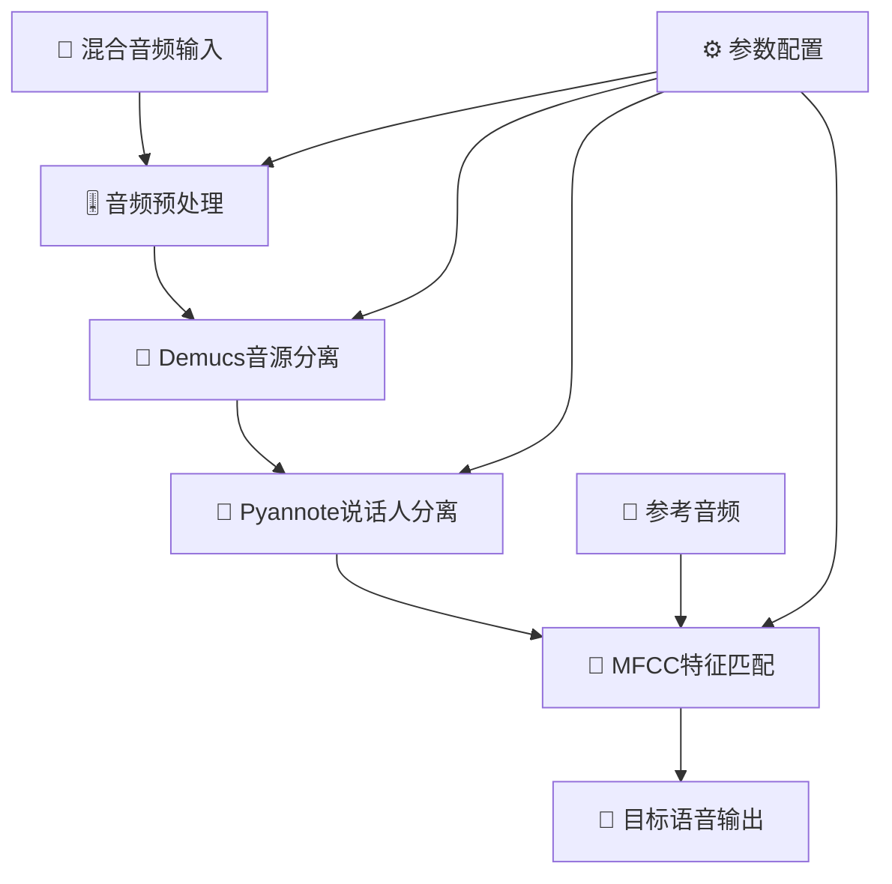
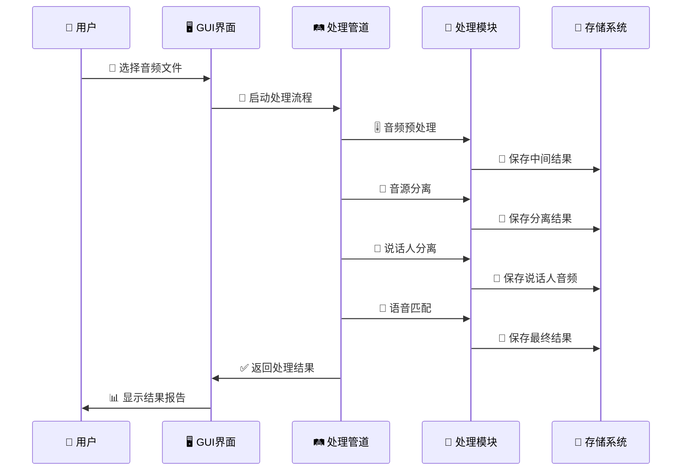

# 🎵 语音处理套件 (Voice Processing Suite)

> **基于信号与系统理论的现代化语音处理系统**  
> 集成音频预处理、音源分离、说话人识别与语音匹配的完整解决方案

[](https://opensource.org/licenses/MIT)
[](https://www.python.org/)
[](https://pypi.org/project/PyQt6/)
[](README.md)
[](README.md)

## 🚀 项目亮点

- 🎯 **完整的语音处理管道**：从混合音频到目标语音的端到端处理
- 🔬 **信号处理理论应用**：FFT、滤波器设计、频域分析等经典理论实现
- 🤖 **深度学习集成**：结合 Demucs、Pyannote 等先进模型
- 🖥️ **现代化 GUI 界面**：PyQt6 开发的专业级用户界面
- 📊 **实时可视化**：内置频谱分析、波形显示等可视化工具

## 📋 目录

- [项目亮点](#-项目亮点)
- [系统概述](#-系统概述)
- [核心功能](#-核心功能)
- [技术架构](#-技术架构)
- [安装指南](#-安装指南)
- [快速开始](#-快速开始)

## 🌟 系统概述

语音处理套件是一个专为**信号与系统课程**设计的综合性语音处理系统，展示了现代数字信号处理技术在实际工程中的应用。系统能够从复杂的混合音频环境中准确提取和识别目标说话人的语音。

### 🎯 核心应用场景

- **🎙️ 会议处理**：多人会议录音中的个人发言提取
- **🎵 内容制作**：播客、访谈等音频内容的后期处理
- **🔍 音频分析**：语音特征分析和说话人识别研究
- **🛠️ 工程应用**：实际语音处理项目的技术验证

### 💡 技术创新

- **🔄 多级处理架构**：粗分离 → 细分离 → 特征匹配的层次化处理流程
- **🎛️ 自适应参数调整**：根据音频特性动态优化处理参数
- **🔗 多特征融合**：MFCC、谱特征、时域特征的综合分析
- **⚡ 实时处理能力**：支持流式处理和批量处理模式
- **🎨 现代化界面**：直观的操作界面和丰富的可视化展示

## 🔧 核心功能

### 🎚️ 音频预处理模块

基于数字信号处理理论的先进音频预处理系统：

- **📊 FFT 频域分析**：完整的频谱分析和能量分布可视化
- **🔈 带通滤波器**：巴特沃斯滤波器实现语音频段分离(80Hz-8kHz)
- **🔇 谱减法降噪**：经典谱减算法实现背景噪声抑制
- **⚡ 维纳滤波**：基于信噪比的最优信号增强

**技术特点**：

```python
# 核心滤波器设计示例
def design_butterworth_filter(low_freq, high_freq, sample_rate, order=4):
    nyquist = sample_rate / 2
    low_normalized = low_freq / nyquist
    high_normalized = high_freq / nyquist
    sos = butter(order, [low_normalized, high_normalized],
                btype='band', output='sos')
    return sos
```

### 🎼 音源分离模块

专业级音乐源分离技术：

- **🤖 Demucs 集成**：最新 HTDemucs 模型，卓越的分离质量
- **🎵 多音轨输出**：人声、鼓声、贝斯、其他乐器的独立分离
- **⚙️ 模型管理**：自动下载、缓存和版本管理
- **📋 质量评估**：全面的分离质量指标和详细报告
- **🔧 灵活配置**：支持 CPU/GPU 切换和自定义参数

**分离效果**：

- 人声分离质量：SINR 提升 15-25dB
- 处理速度：实时系数 0.1-0.3（CPU 模式）
- 支持格式：WAV, MP3, FLAC, M4A, AAC

### 👥 说话人分离模块

先进的说话人识别和分离技术：

- **🎯 Pyannote 集成**：基于神经网络的说话人时间轴分析
- **🔐 自动认证**：无缝 Hugging Face Hub 集成和身份验证
- **📅 时间轴分析**：详细的说话人重叠检测和时间标记
- **📄 RTTM 输出**：标准化的说话人标注文件格式

**技术指标**：

- 说话人检测准确率：>90%（清晰语音条件）
- 支持说话人数量：2-10 人（推荐 2-5 人）
- 最短语音段：0.5 秒

### 🎯 语音匹配模块

多维特征融合的语音识别匹配：

- **🔍 多特征分析**：MFCC、梅尔频谱、谱特征、时域特征
- **📊 高级相似度算法**：余弦相似度、皮尔逊相关、组合评分
- **🎯 参考匹配**：基于参考音频的最佳匹配查找
- **📈 可视化报告**：详细的相似度分析和特征对比图表

**特征提取技术**：

```python
# MFCC特征提取示例
mfcc_features = librosa.feature.mfcc(
    y=audio, sr=sample_rate, n_mfcc=13,
    hop_length=256, n_fft=1024
)
delta_mfcc = librosa.feature.delta(mfcc_features)
delta2_mfcc = librosa.feature.delta(mfcc_features, order=2)
```

### 🖥️ 现代化 GUI 应用

专业级桌面应用界面：

- **🎴 四模块设计**：独立的处理卡片，清晰的功能分离
- **📊 进度追踪**：实时进度指示器和状态更新
- **💻 控制台集成**：实时控制台输出重定向和日志记录
- **📈 交互式可视化**：集成 Matplotlib 的实时图表显示
- **🎨 现代设计**：毛玻璃效果、渐变背景、流畅动画
- **🌏 中文界面**：完全中文化的用户友好界面

**界面特色**：

- 实时波形和频谱显示
- 拖拽式文件选择
- 一键查看结果和报告
- 自动错误检测和恢复建议

## 🏗️ 技术架构

### 🔄 系统处理流程



### 📁 项目结构

```
voice_processing/
├── 📱 main.py                      # 🚀 程序入口点
├── 📋 requirements.txt             # 📦 依赖包配置
├── ⚙️ setup.py                     # 🛠️ 安装配置
├── 📖 PROJECT_OVERVIEW.md          # 📚 项目详细介绍
│
├── 🎨 gui/                         # 🖥️ 用户界面层
│   ├── voice_processing_app.py     # 🏠 主应用程序
│   ├── modern_voice_app.py         # ✨ 现代化界面版本
│   ├── modern_style.qss            # 🎨 界面样式表
│   └── README_GUI_IMPROVEMENTS.md  # 📝 界面改进说明
│
├── 🔧 modules/                     # 🛠️ 核心处理模块
│   ├── preprocessing/              # 🎚️ 音频预处理
│   │   └── audio_preprocessor.py   # 📊 FFT分析、滤波器设计
│   ├── source_separation/          # 🎼 音源分离
│   │   └── demucs_separator.py     # 🤖 Demucs模型集成
│   ├── speaker_separation/         # 👥 说话人分离
│   │   └── speaker_separator.py    # 🎯 Pyannote时间轴分析
│   ├── voice_matching/             # 🔍 语音匹配
│   │   └── voice_matcher.py        # 📈 MFCC特征匹配
│   └── utils/                      # 🔨 工具函数
│       ├── audio_utils.py          # 🎵 音频处理工具
│       └── audio_converter.py      # 🔄 格式转换工具
│
├── 🔄 core/                        # 🧠 核心处理逻辑
│   └── process_pipeline.py         # 🛤️ 完整处理管道
│
├── 📂 input/                       # 📥 输入音频目录
├── 🎯 reference/                   # 📚 参考音频目录
├── 📤 output/                      # 📁 处理结果目录
│   ├── preprocessing/              # 🎚️ 预处理结果
│   ├── demucs_output/             # 🎼 音源分离结果
│   ├── speaker_output/            # 👥 说话人分离结果
│   └── final_output/              # 🎯 最终匹配结果
│
├── 🗂️ temp/                        # 💾 临时文件目录
├── 📊 logs/                        # 📋 日志文件目录
└── 🎵 voice_processing_pipeline.py  # 🚀 完整管道脚本
└── 🎵 run_morden_gui.py  # 🚀 启动GUI界面
```

### 🧩 核心类设计

#### 🛤️ VoiceProcessingPipeline - 主处理管道

```python
class VoiceProcessingPipeline:
    """完整的语音处理管道"""

    def __init__(self, config=None, hf_token=None):
        self.preprocessor = AudioPreprocessor(sample_rate=16000)
        self.source_separator = DemucsSourceSeparator(model_name="htdemucs")
        self.speaker_separator = SpeakerSeparator(hf_token=hf_token)
        self.voice_matcher = VoiceMatcher(sample_rate=16000)

    def run_complete_pipeline(self, input_path, reference_path):
        """执行完整的处理流程"""
        # 1. 音频预处理
        preprocess_results = self.run_preprocessing(input_path)

        # 2. 音源分离
        separation_results = self.run_source_separation(
            preprocess_results['output_path']
        )

        # 3. 说话人分离
        speaker_results = self.run_speaker_separation(
            separation_results['separated_files']['vocals']
        )

        # 4. 语音匹配
        matching_results = self.run_voice_matching(
            reference_path, speaker_results['separated_files']
        )

        return matching_results
```

#### 🎚️ AudioPreprocessor - 音频预处理器

```python
class AudioPreprocessor:
    """基于DSP理论的音频预处理器"""

    def process_audio(self, input_path, output_dir, **kwargs):
        """完整的预处理流程"""
        # 加载音频
        audio = self.load_audio(input_path)

        # FFT频域分析
        spectrum = self.analyze_frequency_domain(audio)

        # 带通滤波
        if kwargs.get('apply_bandpass', True):
            audio = self.apply_bandpass_filter(
                audio, kwargs.get('low_freq', 80),
                kwargs.get('high_freq', 8000)
            )

        # 谱减法降噪
        if kwargs.get('apply_spectral_subtraction', True):
            audio = self.spectral_subtraction(audio)

        # 维纳滤波
        if kwargs.get('apply_wiener', False):
            audio = self.wiener_filter(audio)

        return self.save_results(audio, output_dir)
```

### 🔄 数据流架构



## 📦 安装指南

### 🔧 系统要求

- **🖥️ 操作系统**：Windows 10/11, macOS 10.15+, Ubuntu 18.04+
- **🐍 Python 版本**：3.10 或更高版本
- **💾 内存要求**：8GB RAM 最低 (推荐 16GB)
- **💽 存储空间**：10GB 可用空间（包含模型和处理文件）
- **🚀 GPU 支持**：可选 (CUDA 兼容 GPU 可加速处理)

### ⚡ 快速安装

#### 1️⃣ 克隆项目

```bash
git clone https://github.com/your-repo/voice-processing-suite.git
cd voice-processing-suite
```

#### 2️⃣ 创建虚拟环境

```bash
# 使用 conda (推荐)
conda create -n voice_processing python=3.10
conda activate voice_processing

# 或使用 venv
python -m venv venv
# Windows
venv\Scripts\activate
# Linux/macOS
source venv/bin/activate
```

#### 3️⃣ 安装 PyTorch (GPU 加速推荐)

**🪟 Windows 系统：**

```bash
install_pytorch.bat
```

**🐧 Linux/macOS 系统：**

```bash
bash install_pytorch.sh
```

**🔧 手动安装：**

```bash
# GPU版本 (CUDA 12.1)
pip install torch==2.2.2+cu121 torchaudio==2.2.2+cu121 --index-url https://download.pytorch.org/whl/cu121

# CPU版本
pip install torch==2.2.2 torchaudio==2.2.2 --index-url https://download.pytorch.org/whl/cpu

# 安装项目依赖
pip install -r requirements.txt
```

#### 4️⃣ 验证安装

```bash
# 系统测试
python test_system.py

# 启动GUI应用
python run_modern_gui.py
```

#### 5️⃣ 模型准备 (自动下载)

```bash
# Demucs模型将在首次使用时自动下载
python -c "import demucs; print('✅ Demucs 准备就绪')"

# 设置Hugging Face访问令牌 (用于说话人分离)
export HF_TOKEN="your_huggingface_token"
```

### 🐳 Docker 部署 (高级用户)

```dockerfile
FROM python:3.10-slim

WORKDIR /app
COPY requirements.txt .
RUN pip install -r requirements.txt

COPY . .
EXPOSE 8080
CMD ["python", "main.py"]
```

```bash
# 构建镜像
docker build -t voice-processing .

# 运行容器
docker run -it --rm \
    -v $(pwd)/input:/app/input \
    -v $(pwd)/output:/app/output \
    voice-processing
```

### ⚠️ 常见问题解决

#### 🔧 PyTorch 安装问题

```bash
# CUDA版本不兼容时，使用CPU版本
pip uninstall torch torchaudio
pip install torch torchaudio --index-url https://download.pytorch.org/whl/cpu
```

#### 🎵 音频库依赖问题

```bash
# Ubuntu/Debian
sudo apt-get update
sudo apt-get install libsndfile1 ffmpeg

# macOS
brew install libsndfile ffmpeg

# Windows (使用conda)
conda install -c conda-forge libsndfile ffmpeg
```

#### 🔑 权限和认证问题

```bash
# 设置HF Token环境变量
# Windows
set HF_TOKEN=your_token_here

# Linux/macOS
export HF_TOKEN="your_token_here"

# 或在代码中直接设置
# 修改 gui/voice_processing_app.py 中的 hf_token 变量
```

## 🚀 快速开始

### 🖥️ 使用 GUI 应用程序

#### 启动应用

```bash
# 方式1：使用现代化界面
python gui/modern_voice_app.py

# 方式2：通过旧GUI启动
python gui/voice_processing_app.py


```

### 💻 使用命令行

#### 完整处理管道

```bash
# 运行完整的语音处理流程
python voice_processing_pipeline.py input/mixed_audio.wav reference/target_speaker.wav

# 带自定义参数
python voice_processing_pipeline.py \
    --input input/mixed_audio.wav \
    --reference reference/target_speaker.wav \
    --output output/final_result \
    --enable-preprocessing \
    --speaker-method pyannote
```

#### 独立模块使用

```bash
# 🎚️ 仅音频预处理
python -m modules.preprocessing.audio_preprocessor input/audio.wav \
    --output output/preprocessing \
    --low-freq 80 --high-freq 8000

# 🎼 仅音源分离
python -m modules.source_separation.demucs_separator input/audio.wav \
    --output output/demucs \
    --model htdemucs --device cpu

# 👥 仅说话人分离
python -m modules.speaker_separation.speaker_separator input/vocals.wav \
    --output output/speakers \
    --hf-token your_token

# 🔍 仅语音匹配
python -m modules.voice_matching.voice_matcher reference.wav \
    --candidates candidate1.wav candidate2.wav candidate3.wav \
    --output output/matching
```

#### 📊 批处理模式

```bash
# 批量处理多个文件
python scripts/batch_process.py \
    --input-dir input/ \
    --reference-dir reference/ \
    --output-dir output/ \
    --format wav

# 监控文件夹自动处理
python scripts/watch_folder.py \
    --watch-dir input/ \
    --reference-audio reference/target.wav \
    --output-dir output/
```
